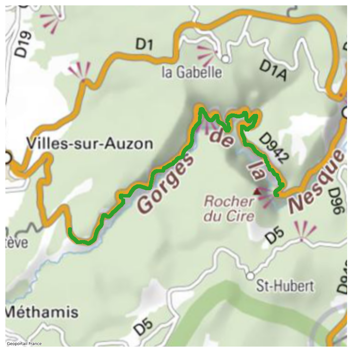

# pygpmf
A python Module to extract GPMF information from Videos

More information on the format is available on the
[GoPro GitHub page](https://github.com/gopro/gpmf-parser).

The primay aim of this project was to be able to extract GPS tracks
from GoPro video files, so the GPS part is more tested.

We use `ffmpeg-python` to extract the GPMF stream from video files.

```python
import gpmf

# Read the binary stream from the file
stream = gpmf.io.extract_gpmf_stream(my_file)

# Extract GPS low level data from the stream
gps_blocks = gpmf.gps.extract_gps_blocks(stream)

# Parse low level data into more usable format
gps_data = list(map(gpmf.gps.parse_gps_block, gps_blocks))
```

We rely on `gpxpy` to easily convert GPS data into GPX segments:  

```python
import gpxpy

gpx = gpxpy.gpx.GPX()
gpx_track = gpxpy.gpx.GPXTrack()
gpx.tracks.append(gpx_track)
gpx_track.segments.append(gpmf.gps.make_pgx_segment(gps_data))

print(gpx.to_xml())
```
```
<?xml version="1.0" encoding="UTF-8"?>
<gpx xmlns="http://www.topografix.com/GPX/1/1" xmlns:xsi="http://www.w3.org/2001/XMLSchema-instance" xsi:schemaLocation="http://www.topografix.com/GPX/1/1 http://www.topografix.com/GPX/1/1/gpx.xsd" version="1.1" creator="gpx.py -- https://github.com/tkrajina/gpxpy">
  <trk>
    <trkseg>
      <trkpt lat="44.1287283" lon="5.427715">
        <ele>833.759</ele>
        <time>2020-07-03T12:36:56.940000Z</time>
        <sym>Square</sym>
        <fix>3d</fix>
        <pdop>1.82</pdop>
        <extensions>
          <speed_2d>
            <value>9.221</value>
            <unit>m/s</unit>
          </speed_2d>
          <speed_3d>
            <value>9.25</value>
            <unit>m/s</unit>
          </speed_3d>
        </extensions>
      </trkpt>
      ...
    </trkseg>
  </trk>
</gpx>
```

You can also make an image from you gps track:

```python
import gpmf

# Read the binary stream from the file
stream = gpmf.io.extract_gpmf_stream(my_file)
gpmf.gps_plot.plot_gps_trace_from_stream(stream)
```


